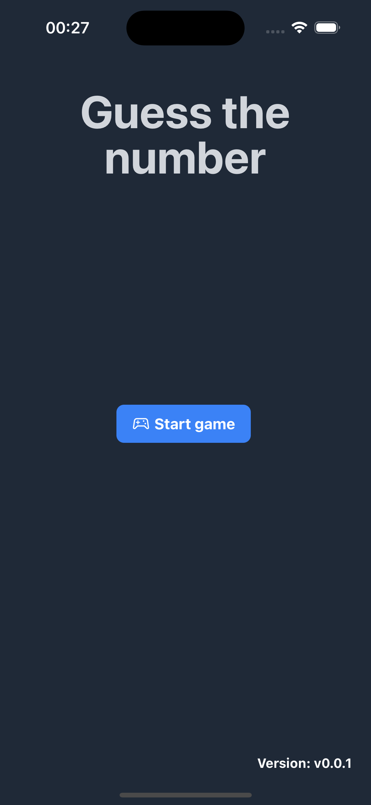

# GTN AI - Guess The Number AI

A number guessing game with the help of artificial intelligence.

## Technologies used

-   React Native
-   Nativewind
-   React navigation
-   i18n
-   Redux - Redux Toolkit
-   Open ai - GPT-3

# Getting Started

> **Note**: After cloning the react native project, you can install react native and the project by following the [steps below](https://reactnative.dev/docs/set-up-your-environment?os=macos&platform=ios)

> **Note**: You should get a key from the [open ai site](https://help.openai.com/en/articles/4936850-where-do-i-find-my-openai-api-key)

> **Note**: Correct the .env.example file to .env and fill it in according to yourself.

## In-app screenshots

### Home Screen

### Game Screen

### Game Screen 2

### Game Over Screen

### Win Screen

